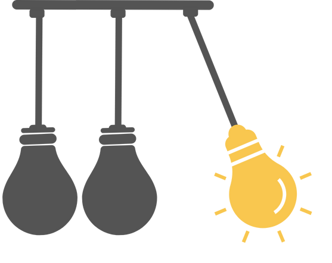

[](https://put-here-your-paper.com)
[](https://opensource.org/licenses/Apache-2.0)
[](https://www.python.org/)


<p align="center">
  
</p>

# In-depth Research Impact Summarization through Fine-Grained Temporal Citation Analysis


Understanding how scientific publications influence their fields is crucial for identifying breakthroughs and guiding future research. However, traditional metrics like citation counts fail to capture the nuanced ways a paper contributes to its field.

This repository contains code and data for [our paper](https://anonymous.4open.science/r/impact-summary-8B64), which aims to address this challenge. We propose a new task: creating detailed, time-sensitive impact summaries that track how researchers use a paper by analyzing its citations.
If you use our work please cite us as described [here](#citation).


Contact person: [Hiba Arnaout](mailto:hiba.arnaout@tu-darmstadt.de) 

[UKP Lab](https://www.ukp.tu-darmstadt.de/) | [TU Darmstadt](https://www.tu-darmstadt.de/
)


### Getting Started
#### Prerequisites
* Python 3.11.2 or higher
* Some code requires an OpenAI API key.
* Some code requires a GPU.

#### Installation

```bash
# Recommended: Create and activate a virtual environment
python3 -m venv myenv
source ./myenv/bin/activate

# Install dependencies
pip install -r requirements.txt
```

#### Setting up the OpenAI API
Some experiments require an OpenAI API key. You can set it up by following the instructions [here](https://beta.openai.com/docs/developer-quickstart/).
After you have the API key, create a simple text file `secret_keys/openai.txt` and paste the key there. The code will automatically read the key from this file.


### Reproducing Results
This part describe how to reproduce the results presented in our the paper.

#### Ablation

```bash
# Decompress the preprocessed variant results.
tar -xf data/preprocessed_summaries.tar.xz -C data/preprocessed_summaries

# Run the ablation experiments
chmod +x scripts/run_ablation_experiments.sh
./scripts/run_ablation_experiments.sh
```

You can rerun the data preprocessing by executing `scripts/ablation_summaries_preprocess.sh`. Note this requires a [Semantic Scholar API key](https://www.semanticscholar.org/product/api#api-key-form)

### Citation
If you use this code or data in your research, please cite our paper:

```bibtex
@article{XXX,
  title={In-depth Research Impact Summarization through Fine-Grained Temporal Citation Analysis},
  author={Arnaout, Hiba and Sternlicht, Noy and Hope, Tom and Gurevych, Iryna},
  journal={Journal Name},
  volume={X},
  number={Y},
  pages={ZZ--ZZ},
  year={2025},
  publisher={Publisher}
}
```

### Authors

Hiba Arnaout, Noy Sternlicht, Tom Hope, Iryna Gurevych.

### Disclaimer

> This repository contains experimental software and is published for the sole purpose of giving additional background details on the respective publication. 
